# ELTE 3D Sensors: LiDAR+GNSS ICP Mapping

Table of Contents

1. Introduction
2. System Overview
   2.1 Sensors
   2.2 Data Characteristics
3. Problem Definition
4. Dataset Description
   4.1 LiDAR PCD Files
   4.2 GPS fix.csv File
5. Methodology
   5.1 Processing Pipeline
   5.2 Block Diagram
   5.3 GPS-Based Global Initial Alignment
   5.4 ICP
   5.5 GNSS starting point calibration
   5.6 Final Map Generation
6. Mathematical Foundations
   6.1 Coordinate Transformations
   6.2 ICP Error Metrics
   6.4 Transformation chain
7. Implementation Details
   7.1 Code Structure
   7.2 Loop Execution Flow
8. Results
   8.1 Parkolo1 Dataset Results
10. Alternative Approaches
11. Conclusion

## 1. Introduction
This project builds a global map by merging sequential LiDAR point clouds aligned with GNSS. GNSS provides a coarse initial guess for the relative motion; ICP refines scan-to-scan alignment, and the refined transforms are accumulated to produce the final map.

## 2. System Overview
### 2.1 Sensors
- 2D LiDAR (~8 Hz)
- RTK-corrected GNSS (~4 Hz)

### 2.2 Data Characteristics
- LiDAR scans saved as .pcd without embedded timestamps.
- GNSS fixes saved in fix.csv with header_stamp_secs and header_stamp_nsecs.
- Filename timestamps for PCDs match GNSS via concatenated secs+nsecs in nanoseconds.
- Motion between scans requires trajectory estimation prior to map fusion.

## 3. Problem Definition
The goal of this assignment is to merge sequential point clouds captured by a 2D LiDAR device mounted on a moving platform (ELTEKart). Because each scan is taken at a different vehicle pose, the trajectory must be estimated before meaningful map fusion can occur.

The LiDAR scans are provided in the pcd.rar archive. These .pcd files do not contain timestamps inside the file, so the filename itself encodes the timestamp. This timestamp is constructed by concatenating the header_stamp_secs and header_stamp_nsecs fields from the corresponding row in fix.csv. This allows each point cloud to be matched with the correct GNSS measurement.

The ELTEKart platform records data from:
- a 2D LiDAR at ≈8 Hz
- an RTK-corrected GNSS receiver at ≈4 Hz

Because the vehicle is moving throughout the recording, the LiDAR scans cannot be merged directly. Instead, the platform’s trajectory must be reconstructed. Two primary strategies are available:

- GPS-based localization
  - Provides absolute position measurements
  - Typical accuracy: 30–40 cm

- Iterative Closest Point (ICP)
  - Computes the relative pose (rotation + translation) between consecutive LiDAR scans
  - Helps refine the trajectory beyond raw GPS accuracy

## 4. Dataset Description
### 4.1 LiDAR PCD Files
- Located under parkolo1/pcd.
- Filenames are nanosecond timestamps (t_ns).
- Loaded with Open3D-compatible reader.

### 4.2 GPS fix.csv File
- Contains header_stamp_secs and header_stamp_nsecs --> combined into t_ns.
- Provides latitude, longitude, altitude per fix.
- Used to time-align LiDAR scans via nearest-neighbor matching with a certain tolerance.

## 5. Methodology
### 5.1 Processing Pipeline
- Load GNSS fixes and compute t_ns.
- Scan pcd directory, parse filenames to t_ns.
- Time-match LiDAR scans to nearest GNSS fix (merge_asof with tolerance).
- Convert GNSS LLA to ECEF, then to local ENU (a local east–north–up Cartesian frame in meters). “First pose as origin” means the first matched GNSS fix defines the ENU frame origin; all later positions are expressed relative to that point.
- For each consecutive pair (prev, curr):
  - Build trans_init from GNSS ENU delta.
  - Run ICP (point-to-point) with max correspondence distance.
  - Accept transform if inlier RMSE threshold met; accumulate to global.
- Merge transformed points; save outputs and visualize.

### 5.2 Block Diagram

The following diagram illustrates the complete processing pipeline from raw data to merged global map:

```mermaid
flowchart TD
    subgraph INPUT["📁 INPUT DATA"]
        A1[("fix.csv<br/>GNSS readings")]
        A2[("pcd/*.pcd<br/>LiDAR scans")]
    end

    subgraph LOAD["📥 DATA LOADING"]
        B1["Load GNSS CSV<br/>Extract: lat, lon, alt, timestamp"]
        B2["Load PCD files<br/>Extract: timestamp from filename"]
    end

    subgraph MATCH["🔗 TIME MATCHING"]
        C1["Convert timestamps to nanoseconds"]
        C2["Match LiDAR scans to nearest GNSS fix<br/>(merge_asof with tolerance)"]
        C3["Drop unmatched rows"]
    end

    subgraph COORD["🌍 COORDINATE TRANSFORM"]
        D1["Set first GNSS pose as origin<br/>(lat₀, lon₀, alt₀)"]
        D2["For each scan:<br/>LLA → ECEF"]
        D3["ECEF → ENU<br/>(local meters)"]
        D4["Store ENU positions array<br/>(N, 3)"]
    end

    subgraph LLA_ECEF["LLA → ECEF Formula"]
        E1["N = a / √(1 - e²sin²φ)"]
        E2["x = (N + h)·cos(φ)·cos(λ)"]
        E3["y = (N + h)·cos(φ)·sin(λ)"]
        E4["z = (N(1-e²) + h)·sin(φ)"]
    end

    subgraph ECEF_ENU["ECEF → ENU Formula"]
        F1["Translate: Δ = P - P₀"]
        F2["Rotate: R·Δ = (e, n, u)"]
    end

    subgraph INIT["⚙️ INITIALIZATION"]
        G1["Load first scan (pcd₀)"]
        G2["T_global_list = [Identity 4×4]"]
        G3["global_points = [pcd₀ points]"]
        G4["trajectory = [[0,0,0]]"]
        G5["prev_pcd = pcd₀"]
    end

    subgraph LOOP["🔄 ICP LOOP (for i = 1 to N-1)"]
        H1["Load current scan (pcd_i)"]
        H2["Get GNSS delta:<br/>δ = ENU[i] - ENU[i-1]"]
        H3["Build initial guess:<br/>trans_init[:3,3] = δ"]
        
        subgraph ICP["🎯 ICP REGISTRATION"]
            I1["Source: current scan"]
            I2["Target: previous scan"]
            I3["Initial guess: trans_init"]
            I4["Run Point-to-Point ICP"]
            I5["Output: T_prev_curr"]
        end
        
        H4{"RMSE < 0.3?"}
        
        subgraph ACCEPT["✅ ACCEPT"]
            J1["Chain transform:<br/>T_curr_global = T_prev_global @ T_prev_curr"]
            J2["Store T_curr_global"]
            J3["Record trajectory:<br/>T_curr_global[:3,3]"]
            J4["Transform points to global:<br/>pts_global = T_curr_global @ pts_h"]
            J5["Append to global_points"]
            J6["Update: prev_pcd = pcd_i"]
        end
        
        subgraph REJECT["❌ REJECT"]
            K1["Copy previous transform"]
            K2["Skip this scan's points"]
        end
    end

    subgraph OUTPUT["📤 OUTPUT"]
        L1["Merge all points:<br/>np.vstack(global_points)"]
        L2["Create Open3D PointCloud"]
        L3["Save merged_global.xyz"]
        L4["Save trajectory_icp.txt"]
        L5["Visualize 3D map"]
    end

    %% Connections
    A1 --> B1
    A2 --> B2
    B1 --> C1
    A2 --> C1
    C1 --> C2
    C2 --> C3
    C3 --> D1
    D1 --> D2
    D2 --> D3
    D3 --> D4
    
    D2 -.-> LLA_ECEF
    D3 -.-> ECEF_ENU
    
    D4 --> G1
    G1 --> G2 --> G3 --> G4 --> G5
    G5 --> H1
    
    H1 --> H2 --> H3 --> I1
    I1 --> I2 --> I3 --> I4 --> I5
    I5 --> H4
    
    H4 -->|Yes| J1
    J1 --> J2 --> J3 --> J4 --> J5 --> J6
    J6 --> H1
    
    H4 -->|No| K1
    K1 --> K2
    K2 --> H1
    
    J5 --> L1
    L1 --> L2
    L2 --> L3
    L2 --> L4
    L2 --> L5

    %% Styling
    classDef input fill:#e1f5fe,stroke:#01579b
    classDef process fill:#fff3e0,stroke:#e65100
    classDef icp fill:#f3e5f5,stroke:#7b1fa2
    classDef output fill:#e8f5e9,stroke:#2e7d32
    classDef decision fill:#fff9c4,stroke:#f57f17
    
    class A1,A2 input
    class B1,B2,C1,C2,C3,D1,D2,D3,D4,G1,G2,G3,G4,G5,H1,H2,H3,J1,J2,J3,J4,J5,J6,K1,K2 process
    class I1,I2,I3,I4,I5 icp
    class L1,L2,L3,L4,L5 output
    class H4 decision
```



### 5.2.1 Pipeline Summary Table

| Stage | Input | Process | Output |
|-------|-------|---------|--------|
| **1. Data Loading** | fix.csv, *.pcd files | Parse CSV, extract timestamps from filenames | gnss_df, pcd_df |
| **2. Time Matching** | gnss_df, pcd_df | merge_asof (nearest neighbor with tolerance) | matched DataFrame |
| **3. Coordinate Transform** | LLA coordinates | LLA → ECEF → ENU | enu_positions (N,3) array |
| **4. Initialization** | First scan | Set identity transform, store first points | T_global_list, global_points |
| **5. ICP Loop** | Consecutive scan pairs | GNSS init guess → ICP refinement → chain transforms | Accumulated transforms |
| **6. Point Transform** | Local points + T_curr_global | Homogeneous multiplication | Global-frame points |
| **7. Merge & Output** | All global points | vstack, create PointCloud | merged_pcd, trajectory |

### 5.2.2 Key Concepts Explained

#### Why GNSS → ENU?
```
GNSS (GPS) gives: latitude, longitude, altitude (degrees + meters)
ICP needs: local Cartesian coordinates (meters)

Solution: Convert to ENU (East-North-Up) centered at first pose
- First pose becomes origin [0, 0, 0]
- All other positions in meters relative to origin
```

#### Why use GNSS as initial guess?
```
ICP can fail if:
- Initial alignment is too far off
- Scans don't overlap enough

GNSS provides ~30-40cm accuracy initial guess
ICP refines to ~cm accuracy
```

#### Transform Chain Visualization
```
Scan 0 ──────────────────────────────► Global Frame
         │                                    ▲
         │ T₁→₀ (ICP)                        │
         ▼                                    │
Scan 1 ──────► T₁→global = I @ T₁→₀ ─────────┤
         │                                    │
         │ T₂→₁ (ICP)                        │
         ▼                                    │
Scan 2 ──────► T₂→global = T₁→global @ T₂→₁ ─┤
         │                                    │
        ...                                  ...
```

## 5.3 GPS-Based Global Initial Alignment
- GNSS positions provide coarse motion between scans.
- Used only as an initial guess; not trusted as final transform due to biases, latency, and measurement noise.

## 5.4 ICP
- Iterative Closest Point aligns two point sets by:
  - Finding closest-point correspondences within a max distance.
  - Estimating rigid transform minimizing point-to-point error.
  - Iterating until convergence or max iterations.
- Implementation uses Open3D registration_icp with point-to-point estimation.

## 5.5 GNSS starting point calibration
- Instead of directly applying GNSS as the transform, use GNSS ENU delta as trans_init for ICP between current and previous PCDs.
- ICP refines this guess to recover the relative motion with better local consistency.

## 5.6 Final Map Generation
- Apply accumulated transforms to each scan.
- Concatenate all transformed points.
- Return an Open3D PointCloud, write merged_global.xyz, and trajectory_icp.txt.

## 6. Mathematical Foundations
### 6.1 Coordinate Transformations
- Intuition: LLA (latitude, longitude, altitude) are angular/geodetic coordinates. ECEF is a global Earth-fixed Cartesian frame (x, y, z). ENU is a local tangent-plane Cartesian frame centered at a chosen origin (here: the first GNSS pose), with axes: x=east, y=north, z=up, all in meters. Using ENU makes small-area mapping linear and numerically stable.
- LLA→ECEF (WGS84):
  - a = 6378137.0, e² ≈ 6.69437999014e−3
  - N = a / sqrt(1 − e² sin² φ)
  - x = (N + h) cos φ cos λ
  - y = (N + h) cos φ sin λ
  - z = (N (1 − e²) + h) sin φ
- ECEF→ENU at origin (φ₀, λ₀, h₀):
  - Translate by origin ECEF (x₀, y₀, z₀)
  - Rotate with:
    R = [
      [−sin λ₀,             cos λ₀,              0],
      [−sin φ₀ cos λ₀,    −sin φ₀ sin λ₀,    cos φ₀],
      [ cos φ₀ cos λ₀,     cos φ₀ sin λ₀,    sin φ₀]
    ]
- Origin is the first matched GNSS pose.

### 6.2 ICP Error Metrics
- Point-to-point RMSE over inlier correspondences.
- Accept transform if inlier_rmse < 0.3 (tunable).
- Correspondence gating via max_correspondence_distance (default 1.0 m).

### 6.4 Transformation chain
- Let T_prev_curr be transform mapping current → previous (ICP output).
- Global accumulation:
  - T_curr_global = T_prev_global @ T_prev_curr
- GNSS delta:
  - δ = ENU(curr) − ENU(prev)
  - trans_init[:3, 3] = δ

## 7. Implementation Details
### 7.1 Code Structure
- Pose (@dataclass): container for GNSS pose fields.
- LidarGnssDataset:
  - Loads and time-matches GNSS and PCD.
  - Provides iteration and access to scan paths and matched poses.
  - plot_trajectory to visualize matched fixes and time offsets.
  - load_pcd with a simple ASCII PCD reader.
- merge_dataset_to_global_map_icp:
  - LLA→ECEF→ENU conversion helpers.
  - ICP loop with GNSS-based trans_init.
  - Transform accumulation and global merging.
  - Optional outputs and Open3D visualization hook.

### 7.2 Loop Execution Flow
- For i from 1 to N−1:
  - Read prev and curr scans.
  - Build trans_init from GNSS ENU delta.
  - Run ICP (curr as source, prev as target).
  - If accepted: accumulate transform, append points and trajectory.
  - Else: repeat previous pose.

## 8. Results
### 8.1 Parkolo1 Dataset Results
- Example paths:
  - Inputs: parkolo1/fix.csv, parkolo1/pcd/
  - Outputs: parkolo1/outputs/merged_global.xyz, trajectory_icp.txt
- Trajectory visualization: dataset.plot_trajectory(color_by_dt=True) shows time-offset coloring.
- Typical behavior: GNSS provides coarse alignment; ICP refines locally and improves map continuity.

## 10. Alternative Approaches
- Point-to-plane ICP (requires normals) for faster convergence.
- NDT (Normal Distributions Transform) for robust registration.
- Pose graph optimization (loop closures) to reduce drift.
- Robust kernels / outlier rejection strategies.
- Sensor fusion with wheel odometry or IMU.

## 11. Conclusion
The pipeline leverages GNSS for a globally consistent initial motion estimate and ICP for locally consistent refinement. Accumulating refined transforms yields a coherent global map from sequential 2D LiDAR scans, with simple, modular code that can be extended to more advanced registration and optimization techniques.
